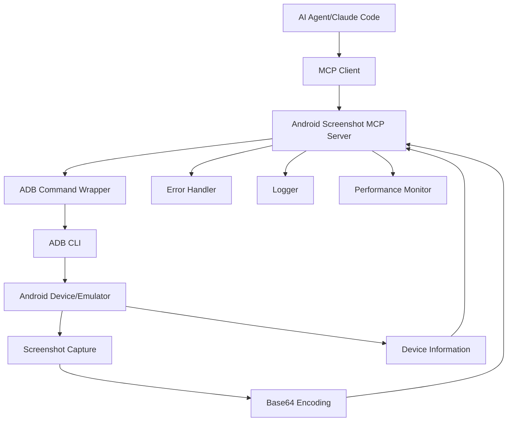

# Android Screenshot MCP Server - Implementation Plan

Based on my analysis of the requirements and gathered information, I've created a comprehensive todo list for building the Android Screenshot MCP Server. Here's a detailed breakdown of the implementation approach:

## Architecture Overview



## Technical Approach

Based on my analysis, I recommend using **native ADB commands** via `execSync` for the following reasons:

1. **Simplicity**: Direct ADB commands are straightforward to implement and maintain
2. **Compatibility**: Works with any ADB installation without additional dependencies
3. **Reliability**: Native commands are well-tested and stable
4. **Performance**: Minimal overhead compared to library wrappers

For deployment, I recommend a **hybrid approach**:

- Primary distribution as an NPM package for easy installation
- Docker container option for isolated deployment
- Standalone executable option for users who prefer not to use Node.js

## Key Implementation Details

### 1. Project Structure

```
android-ui-assist-mcp/
├── src/
│   ├── server.ts           # Main MCP server implementation
│   ├── types.ts            # TypeScript interfaces and types
│   ├── utils/
│   │   ├── adb.ts          # ADB command utilities
│   │   ├── screenshot.ts  # Screenshot processing utilities
│   │   └── error.ts        # Error handling utilities
│   └── index.ts            # Entry point
├── tests/
│   ├── unit/               # Unit tests
│   ├── integration/        # Integration tests
│   └── mocks/              # Mock implementations
├── docs/                   # Documentation
├── examples/               # Usage examples
├── docker/                 # Docker configuration
└── scripts/                # Build and deployment scripts
```

### 2. Core Components

#### MCP Server Implementation

- Use the MCP TypeScript SDK with `StdioServerTransport`
- Implement two main tools:
  - `take_android_screenshot`: Capture screenshots with optional device ID and format
  - `list_android_devices`: List available devices with status information

#### ADB Integration

- Wrapper functions for essential ADB commands:
  - `adb devices -l` for device listing
  - `adb -s <id> exec-out screencap -p` for screenshot capture
  - `adb version` for verification
- Proper error handling for common scenarios:
  - ADB not installed
  - No devices connected
  - Device timeouts
  - Permission issues

#### Error Handling

- Custom error classes for different error scenarios
- User-friendly error messages with suggested solutions
- Proper logging for debugging

### 3. Performance Considerations

- Implement timeout handling for ADB operations (target: <5 seconds)
- Memory optimization to stay under 50MB limit
- Proper cleanup of temporary files
- Efficient base64 encoding of screenshots

### 4. User Experience

- Clear error messages with actionable guidance
- Comprehensive documentation with examples
- Setup scripts for easy installation
- Multiple deployment options (NPM, Docker, standalone)

## Development Phases

The todo list is organized into logical phases:

1. **Project Setup** (Items 1-5): Initialize the project with proper tooling
2. **Type Definitions** (Items 6-9): Define interfaces and error handling
3. **ADB Integration** (Items 10-14): Implement core ADB functionality
4. **MCP Server** (Items 15-19): Build the MCP server with tools
5. **Optimization** (Items 20-23): Add performance and debugging features
6. **Testing** (Items 24-27): Create comprehensive test suite
7. **Documentation** (Items 28-31): Write user-facing documentation
8. **Distribution** (Items 32-35): Prepare for deployment
9. **Final Review** (Items 36-39): Optimize and finalize

## Success Criteria Alignment

The implementation plan addresses all success criteria:

- ✅ Works with Expo development workflow (through standard ADB)
- ✅ Compatible with Android Studio AVDs (through standard ADB)
- ✅ Integrates with Claude Code for UI analysis (through MCP protocol)
- ✅ Setup time <10 minutes (through automated scripts and clear docs)
- ✅ Handles edge cases gracefully (comprehensive error handling)

## Todo List

1. Project setup and initialization
2. Set up TypeScript project structure with proper configuration
3. Install MCP TypeScript SDK and dependencies
4. Configure ESLint, Prettier, and Husky for code quality
5. Create package.json with scripts and metadata
6. Design and implement TypeScript interfaces
7. Define device information interface (device ID, status, model, etc.)
8. Define screenshot response interface (base64 data, metadata, dimensions)
9. Define error handling interfaces and custom error classes
10. Implement ADB utility functions
11. Create ADB command execution wrapper with proper error handling
12. Implement device detection and listing functionality
13. Implement screenshot capture functionality with format options
14. Add proper cleanup of temporary files
15. Implement MCP server core
16. Create MCP server instance with proper capabilities
17. Implement take_android_screenshot tool with input validation
18. Implement list_android_devices tool
19. Add proper error handling and user-friendly error messages
20. Add performance monitoring and optimization
21. Implement timeout handling for ADB operations
22. Add memory usage optimization
23. Implement proper logging for debugging
24. Create comprehensive test suite
25. Write unit tests for ADB utility functions
26. Write integration tests for MCP server functionality
27. Mock ADB commands for testing
28. Create documentation and examples
29. Write detailed README with setup instructions
30. Create example usage scripts
31. Document error scenarios and troubleshooting steps
32. Package and distribution
33. Set up build process for distribution
34. Create installation and setup scripts
35. Add Docker support for easy deployment
36. Final review and optimization
37. Performance testing and optimization
38. Security review
39. Final documentation updates
