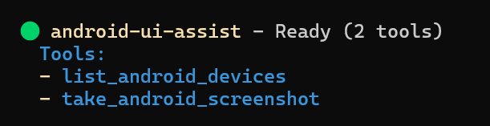
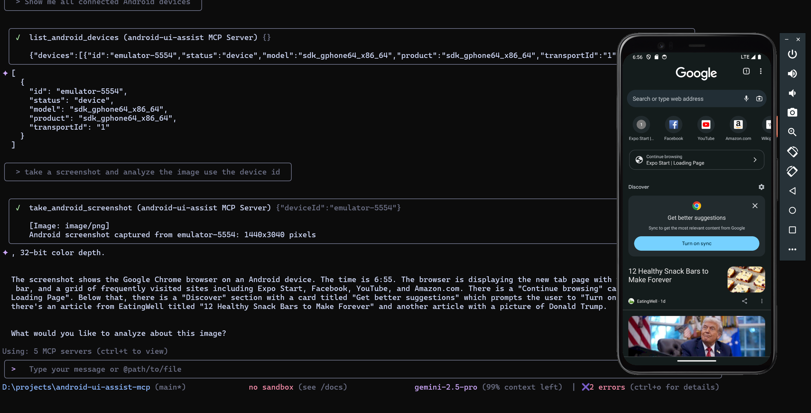

# Real-Time Android UI Development with AI Agents - MCP Server

[](https://badge.fury.io/js/android-ui-assist-mcp)
[](https://opensource.org/licenses/MIT)
[](https://typescriptlang.org)
[](https://nodejs.org)

Model Context Protocol server that enables AI coding agents to see and analyze your Android app UI in real-time during development. Perfect for iterative UI refinement with Expo, React Native, Flutter, and native Android development workflows. Connect your AI agent to your running app and get instant visual feedback on UI changes.

**Keywords:** android development ai agent, real-time ui feedback, expo development tools, react native ui assistant, flutter development ai, android emulator screenshot, ai powered ui testing, visual regression testing ai, mobile app development ai, iterative ui development, ai code assistant android

## Quick Demo

See the MCP server in action with real-time Android UI analysis:

| MCP Server Status | Live Development Workflow |
|-------------------|---------------------------|
|  |  |
| Server ready with 2 tools available | AI agent analyzing Android UI in real-time |

## Features

**Real-Time Development Workflow**
- Live screenshot capture during app development with Expo, React Native, Flutter
- Instant visual feedback for AI agents on UI changes and iterations
- Seamless integration with development servers and hot reload workflows
- Support for both physical devices and emulators during active development

**AI Agent Integration**
- MCP protocol support for Claude Desktop, GitHub Copilot, and Gemini CLI
- Enable AI agents to see your app UI and provide contextual suggestions
- Perfect for iterative UI refinement and design feedback loops
- Visual context for AI-powered code generation and UI improvements

**Developer Experience**
- Zero-configuration setup with running development environments
- Docker deployment for team collaboration and CI/CD pipelines
- Comprehensive error handling with helpful development suggestions
- Secure stdio communication with timeout management

## Table of Contents

- [Development Workflow](#development-workflow)
- [Prerequisites](#prerequisites)
- [Installation](#installation)
- [AI Agent Configuration](#ai-agent-configuration)
- [Development Environment Setup](#development-environment-setup)
- [Docker Deployment](#docker-deployment)
- [Available Tools](#available-tools)
- [Usage Examples](#usage-examples)
- [Troubleshooting](#troubleshooting)
- [Development](#development)

## Development Workflow

This MCP server transforms how you develop Android UIs by giving AI agents real-time visual access to your running application. Here's the typical workflow:

1. **Start Your Development Environment**: Launch Expo, React Native Metro, Flutter, or Android Studio with your app running
2. **Connect the MCP Server**: Configure your AI agent (Claude, Copilot, Gemini) to use this MCP server
3. **Iterative Development**: Ask your AI agent to analyze the current UI, suggest improvements, or help implement changes
4. **Real-Time Feedback**: The AI agent takes screenshots to see the results of code changes immediately
5. **Refine and Repeat**: Continue the conversation with visual context for better UI development

**Perfect for:**
- Expo development with live preview and hot reload
- React Native development with Metro bundler
- Flutter development with hot reload
- Native Android development with instant run
- UI testing and visual regression analysis
- Collaborative design reviews with AI assistance
- Accessibility testing with visual context
- Cross-platform UI consistency checking

## Prerequisites

| Component | Version | Installation                                                                               |
| --------- | ------- | ------------------------------------------------------------------------------------------ |
| Node.js   | 18.0+   | [Download](https://nodejs.org)                                                             |
| npm       | 8.0+    | Included with Node.js                                                                      |
| ADB       | Latest  | [Android SDK Platform Tools](https://developer.android.com/studio/releases/platform-tools) |

### Android Device Setup

1. Enable Developer Options: Settings > About Phone > Tap "Build Number" 7 times
2. Enable USB Debugging: Settings > Developer Options > USB Debugging
3. Verify connection: `adb devices`

## Installation

### NPM Installation

```bash
npm install -g android-ui-assist-mcp
```

### From Source

```bash
git clone https://github.com/yourusername/android-ui-assist-mcp
cd android-ui-assist-mcp
npm install && npm run build
```

## AI Agent Configuration

### Claude Desktop

Create or edit `%APPDATA%\Claude\claude_desktop_config.json`:

```json
{
  "mcpServers": {
    "android-ui-assist": {
      "command": "npx",
      "args": ["android-ui-assist-mcp"],
      "timeout": 10000
    }
  }
}
```

For local development:

```json
{
  "mcpServers": {
    "android-ui-assist": {
      "command": "node",
      "args": ["d:\\projects\\android-ui-assist-mcp\\dist\\index.js"],
      "timeout": 10000
    }
  }
}
```

Restart Claude Desktop to apply configuration.

## Development Environment Setup

### Expo Development

1. Start your Expo development server:
```bash
npx expo start
# or
npm start
```

2. Open your app on a connected device or emulator
3. Ensure your device appears in `adb devices`
4. Your AI agent can now take screenshots during development

### React Native Development

1. Start Metro bundler:
```bash
npx react-native start
```

2. Run on Android:
```bash
npx react-native run-android
```

3. Enable hot reload for instant feedback with AI analysis

### Flutter Development

1. Start Flutter in debug mode:
```bash
flutter run
```

2. Use hot reload (`r`) and hot restart (`R`) while getting AI feedback
3. The AI agent can capture UI states after each change

### Native Android Development

1. Open project in Android Studio
2. Run app with instant run enabled
3. Connect device or start emulator
4. Enable AI agent integration for real-time UI analysis

### Gemini CLI

Install and configure:

```bash
npm install -g @google/generative-ai-cli
gemini auth login
```

**Method 1: Command Line Configuration**

```bash
# For NPM installation
gemini mcp add android-ui-assist npx android-ui-assist-mcp

# For local development
gemini mcp add android-ui-assist node "/path/to/android-ui-assist-mcp/dist/index.js"
```

**Method 2: Configuration File**

Create `~/.gemini/settings.json` (Windows: `%USERPROFILE%\.gemini\settings.json`):

```json
{
  "mcpServers": {
    "android-ui-assist": {
      "command": "npx",
      "args": ["android-ui-assist-mcp"]
    }
  }
}
```

For local development:

```json
{
  "mcpServers": {
    "android-ui-assist": {
      "command": "node",
      "args": ["/path/to/android-ui-assist-mcp/dist/index.js"]
    }
  }
}
```

Verify: `gemini mcp list`

### GitHub Copilot (VS Code)

Create `.vscode/settings.json` in your project:

```json
{
  "github.copilot.enable": {
    "*": true
  },
  "mcp.servers": {
    "android-ui-assist": {
      "command": "npx",
      "args": ["android-ui-assist-mcp"],
      "timeout": 10000
    }
  }
}
```

## Docker Deployment

### Docker Compose

```bash
cd docker
docker-compose up --build -d
```

Configure AI platform for Docker:

```json
{
  "mcpServers": {
    "android-ui-assist": {
      "command": "docker",
      "args": ["exec", "android-ui-assist-mcp", "node", "/app/dist/index.js"],
      "timeout": 15000
    }
  }
}
```

### Manual Docker Build

```bash
docker build -t android-ui-assist-mcp .
docker run -it --rm --privileged -v /dev/bus/usb:/dev/bus/usb android-ui-assist-mcp
```

## Available Tools


| Tool                      | Description                | Parameters            |
| ------------------------- | -------------------------- | --------------------- |
| `take_android_screenshot` | Captures device screenshot | `deviceId` (optional) |
| `list_android_devices`    | Lists connected devices    | None                  |

### Tool Schemas

**take_android_screenshot**

```json
{
  "name": "take_android_screenshot",
  "description": "Capture a screenshot from an Android device or emulator",
  "inputSchema": {
    "type": "object",
    "properties": {
      "deviceId": {
        "type": "string",
        "description": "Optional device ID. If not provided, uses the first available device"
      }
    }
  }
}
```

**list_android_devices**

```json
{
  "name": "list_android_devices",
  "description": "List all connected Android devices and emulators with detailed information",
  "inputSchema": {
    "type": "object",
    "properties": {}
  }
}
```

## Usage Examples


*Example: AI agent listing devices, capturing screenshots, and providing detailed UI analysis in real-time*

### Real-Time UI Development

With your development environment running (Expo, React Native, Flutter, etc.), interact with your AI agent:

**Initial Analysis:**
- "Take a screenshot of my current app UI and analyze the layout"
- "Show me the current state of my login screen and suggest improvements"
- "Capture the app and check for accessibility issues"

**Iterative Development:**
- "I just changed the button color, take another screenshot and compare"
- "Help me adjust the spacing - take a screenshot after each change"
- "Take a screenshot and tell me if the new navigation looks good"

**Cross-Platform Testing:**
- "Capture screenshots from both my phone and tablet emulator"
- "Show me how the UI looks on device emulator-5554 vs my physical device"

**Development Debugging:**
- "List all connected devices and their status"
- "Take a screenshot from the specific emulator running my debug build"
- "Capture the current error state and help me fix the UI issue"

## Troubleshooting

### ADB Issues

- **ADB not found**: Verify ADB is installed and in PATH
- **No devices**: Check USB connection and debugging authorization
- **Device unauthorized**: Disconnect/reconnect USB, check device authorization prompt
- **Screenshot failed**: Ensure device is unlocked and properly connected

### Connection Issues

- Verify `adb devices` shows your device as "device" status
- Restart ADB server: `adb kill-server && adb start-server`
- Check USB debugging permissions on device

## Development

### Build Commands

```bash
npm run build     # Production build
npm test          # Run tests
npm run lint      # Code linting
npm run format    # Code formatting
```

### Project Structure

```
src/
├── server.ts         # MCP server implementation
├── types.ts          # Type definitions
├── utils/
│   ├── adb.ts        # ADB command utilities
│   ├── screenshot.ts # Screenshot processing
│   └── error.ts      # Error handling
└── index.ts          # Entry point
```

## Performance

- 5-second timeout on ADB operations
- In-memory screenshot processing
- Stdio communication for security
- Minimal privilege execution

## License

MIT License - see LICENSE file for details.
